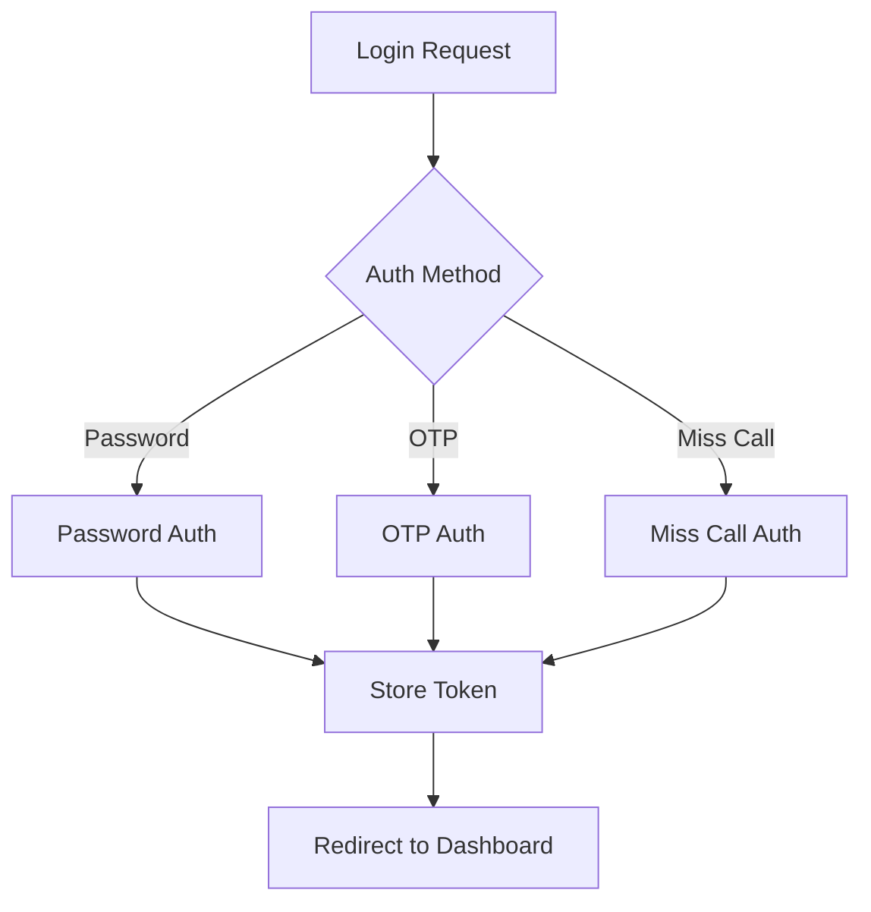

# CRM Sitra Front

A comprehensive **dental clinic CRM system** built with Vue 3, featuring Persian language support and RTL layout. The system manages patients, appointments, treatments, billing, and clinic operations with a modern modular architecture.

## 📋 Table of Contents

- [Overview](#overview)
- [Features](#features)
- [Tech Stack](#tech-stack)
- [Project Structure](#project-structure)
- [Getting Started](#getting-started)
- [Development](#development)
- [Scripts](#scripts)
- [Architecture](#architecture)
- [Modules](#modules)
- [Deployment](#deployment)
- [Contributing](#contributing)

## 🏥 Overview

CRM Sitra Front is a modern, feature-rich customer relationship management system specifically designed for dental clinics. It provides comprehensive tools for managing patient records, appointments, treatment plans, financial transactions, and clinic operations with full Persian language and RTL support.

## ✨ Features

### 📊 Core Functionality
- **Patient Management**: Complete patient profiles with medical records, contact information, and history
- **Appointment Scheduling**: Advanced booking system with coordinator assignment and visit tracking
- **Treatment Planning**: Comprehensive dental treatment planning with pricing and installment options
- **Financial Management**: Payment processing, transaction tracking, and POS integration
- **Task Management**: Assignment and tracking of clinic tasks
- **Reports & Analytics**: Comprehensive reporting system with charts and insights
- **Campaign Management**: Marketing campaign tools with batch import capabilities
- **Survey System**: Patient feedback collection and analysis

### 🌐 Technical Features
- **Multi-Authentication**: Password, OTP, and miss call authentication methods
- **Role-Based Access Control**: Granular permissions and user role management
- **Real-time Updates**: Live data synchronization using TanStack Query
- **Offline Support**: Progressive Web App with offline capabilities
- **Persian Calendar**: Full Jalali calendar integration
- **RTL Layout**: Complete right-to-left language support
- **Responsive Design**: Mobile-first responsive interface
- **Error Tracking**: GlitchTip integration for monitoring
- **Performance Optimized**: Code splitting and lazy loading

## 🛠 Tech Stack

### Frontend Framework
- **Vue 3** with Composition API
- **Vite 5.4** as build tool (Vite 6 upgrade pending in TODO.md)
- **TypeScript** support

### UI Framework
- **Quasar Framework 2.19** (primary UI components)

### State Management & Data
- **Pinia 3.0** for global state management
- **TanStack Query 5.24** for server state and caching
- **Vue Router 4.2** for navigation

### Validation & Forms
- **Yup 1.2** for schema validation (with custom useYup composable)

### HTTP & API
- **Axios 1.4** for HTTP requests with interceptors
- **Custom API layer** with automatic camelCase/snake_case conversion

### Date & Localization
- **Custom date-utils** for Persian date handling (pure JavaScript implementation, no external libraries)

### Fonts & Icons
- **Shabnam & Vazirmatn** fonts for Persian typography
- **@tabler/icons-vue** (icon library)

### Development Tools
- **ESLint 8** with Airbnb config (ESLint 9 migration pending in TODO.md)
- **Prettier** for code formatting
- **Husky 8** for git hooks (Husky 9 migration pending in TODO.md)
- **GlitchTip** for error tracking (via the Sentry-compatible `@sentry/vue` 10 SDK)

## 🏗 Project Structure

```
src/
├── components/           # Shared components
│   ├── Form/            # Form field components
│   ├── DataTable/       # Table and filter components
│   ├── Layout/          # Layout components
│   └── ChartBuilder/    # Chart components
├── modules/             # Feature modules
│   ├── Auth/            # Authentication
│   ├── User/            # User management
│   ├── Booking/         # Appointments
│   ├── TreatmentPlan/   # Treatment planning
│   ├── Attendance/      # Staff attendance & check-in/out
│   ├── Contact/         # Communication
│   ├── Task/            # Task management
│   ├── Settings/        # System settings
│   ├── Ads/             # Campaigns
│   ├── Survey/          # Feedback system
│   └── Reports/         # Analytics (currently disabled)
├── layout/              # Layout templates
├── composables/         # Reusable logic
├── utils/               # Utility functions
├── store/               # Pinia stores
├── assets/              # Static assets
└── router/              # Route configuration
```

### Module Architecture

Each business module follows a consistent structure:

```
ModuleName/
├── api/                 # API endpoint functions
├── components/          # Module-specific components
├── pages/               # Route components
├── query/               # TanStack Query hooks
├── router.js            # Module routes
├── schema/              # Yup validation schemas
└── utils/               # Module utilities
```

## 🚀 Getting Started

### Prerequisites

- **Node.js**: 20.19.5 (managed via Volta, as specified in package.json)
- **npm**: 10.8.2+ (comes with Node 20.19.5)

### Installation

1. Clone the repository:
```bash
git clone <repository-url>
cd crm-sitra-front
```

2. Install dependencies:
```bash
npm ci
```

3. Set up environment variables:
```bash
# Copy environment template (if exists)
cp .env.example .env
# Configure your API URLs and keys
```

4. Start development server:
```bash
npm run dev
```

The application will be available at `http://localhost:4000`

## 💻 Development

### Development Server

```bash
npm run dev          # Start dev server (http://localhost:4000)
```

### Code Quality

```bash
npm run lint         # Run ESLint with auto-fix
npm run format       # Run Prettier formatting
```

### Building

```bash
npm run build        # Production build
npm run build-only   # Build without type checking
npm run analyze      # Build with bundle analyzer
npm run preview      # Preview production build
```

## 📜 Scripts

| Command | Description |
|---------|-------------|
| `npm run dev` | Start development server on port 4000 |
| `npm run build` | Create production build |
| `npm run analyze` | Build with bundle size analysis |
| `npm run preview` | Preview production build |
| `npm run lint` | Lint and fix code with ESLint |
| `npm run format` | Format code with Prettier |
| `npm run prepare` | Setup Husky git hooks |

## 🏛 Architecture

### Data Flow Pattern

1. **API-First Architecture**: All data operations through TanStack Query
2. **Centralized State**: Pinia stores for user auth and offline status
3. **Module-Based**: Feature modules with isolated concerns
4. **Query Pattern**: Standardized data fetching with hooks
5. **Form Validation**: Yup schemas with custom useYup composable

### Authentication Flow



### Permission System

- **Role-Based Access**: Users assigned to roles with specific permissions
- **Module Permissions**: Granular access control per module
- **Route Guards**: Automatic permission checking
- **Component-Level**: Conditional rendering based on permissions

## 🧩 Modules

### Core Modules

| Module | Description | Key Features |
|--------|-------------|--------------|
| **Auth** | Authentication system | Multi-method login, session management |
| **User** | User management | Patient profiles, medical records, payment processing |
| **Contact** | Communication | Contact history, call duration tracking |
| **Booking** | Appointment system | Scheduling, coordinator assignment, visit tracking |
| **TreatmentPlan** | Treatment planning | Dental procedures, pricing, installments |
| **Attendance** | Staff attendance | Check-in/out, room selection, attendance log |
| **Task** | Task management | Assignment, tracking, notifications |
| **Settings** | System configuration | Clinic settings, roles, SMS panel |

### Support Modules

| Module | Description |
|--------|-------------|
| **Dashboard** | Main overview with widgets and analytics |
| **Ads** | Marketing campaign management |
| **Survey** | Patient feedback system (routes under `Survey/Feedback`) |
| **misc** | Miscellaneous utilities and components |
| **Reports** | Analytics & reporting — currently disabled (routes commented out, api/query stubs only) |

## 🚀 Deployment

### Docker Deployment

```bash
# Build Docker image
docker build -t crm-sitra-front .

# Run container
docker run -p 80:80 crm-sitra-front
```

### Kubernetes Deployment

Helm charts are available in the `cicd/crm-sitra-front/` directory:

```bash
# Deploy to staging
helm install crm-sitra-stage ./cicd/crm-sitra-front -f ./cicd/crm-sitra-front/values-stage.yaml

# Deploy to production
helm install crm-sitra-prod ./cicd/crm-sitra-front -f ./cicd/crm-sitra-front/values.yaml
```

### Environment Variables

| Variable | Description | Required |
|----------|-------------|----------|
| `VITE_API_PROXY_URL` | Backend API URL | Yes |
| `VITE_GLITCHTIP_DSN` | GlitchTip error tracking DSN | No |
| `VITE_GLITCHTIP_URL` | GlitchTip server URL | No |
| `VITE_GLITCHTIP_TRACES_SAMPLE_RATE` | Performance sample rate (0.0–1.0, default `0.01`) | No |
| `VITE_GLITCHTIP_AUTH_TOKEN` | Build-time source map upload token (CI secret) | No |
| `VITE_GLITCHTIP_ORG` | GlitchTip organization slug (source map upload only) | No |
| `VITE_GLITCHTIP_PROJECT` | GlitchTip project slug (source map upload only) | No |

## 🔄 Migration Status

The project has successfully completed all migrations.

**Current Status (Updated 2026-06-18):**
- Total Vue files: **310**
- Element Plus migration: **100% complete** (fully removed)
- Date libraries migration: **100% complete** (pure JS implementation, no external dependencies)
- Icon libraries: **100% complete** (@tabler/icons-vue exclusively, @iconify/vue removed)
- Bootstrap classes: **100% complete** (fully removed)
- Error tracking: **100% complete** (migrated from Sentry to self-hosted GlitchTip)
- Runtime package upgrades: Vue 3.5.x, Quasar 2.19.x, Pinia 3.0.x, and `@sentry/vue` 10.x complete
- Tooling package upgrades: Vite 6, ESLint 9, and Husky 9 remain pending in TODO.md

**Completed Migrations:**
- Element Plus → Quasar components
- Date libraries (moment, dayjs, jalali-moment) → Pure JS date-utils
- VeeValidate → Yup validation
- @iconify/vue → @tabler/icons-vue
- Bootstrap classes → BEM methodology
- Legacy/commented migration artifacts removed

## 📖 Documentation

- **[CLAUDE.md](./CLAUDE.md)** - Development guidelines and architecture notes
- **[UI_FRAMEWORKS_REFERENCE.md](./UI_FRAMEWORKS_REFERENCE.md)** - UI framework reference

## 🤝 Contributing

### Development Guidelines

1. **Code Style**: Follow ESLint Airbnb configuration
2. **Components**: Use Quasar components only
3. **Naming**: PascalCase for components, camelCase for functions
4. **CSS**: Use BEM methodology, avoid utility classes in `<style>` sections
5. **Dates**: Use date-utils functions only (pure JS, no external libraries)
6. **Validation**: Use Yup with useYup composable
7. **Commits**: Conventional commit messages with emoji

### Code Quality Checklist

- [ ] ESLint passes without errors
- [ ] Prettier formatting applied
- [ ] Quasar components only (no third-party UI frameworks)
- [ ] date-utils only for date operations (no external date libraries)
- [ ] BEM methodology for CSS
- [ ] Persian/RTL compatibility tested

### Pull Request Process

1. Create feature branch from `master`
2. Implement changes following guidelines
3. Run `npm run lint` and `npm run format`
4. Test functionality thoroughly
5. Update documentation if needed
6. Create PR with descriptive title and body

## 📄 License

This project is proprietary software. All rights reserved.

## 🆘 Support

For development questions or issues:
- Check [CLAUDE.md](./CLAUDE.md) for development guidelines
- Contact the development team

---

**Version**: 2.8.0
**Node Version**: 20.19.5 (volta-managed)
**Last Updated**: 2026-06-18